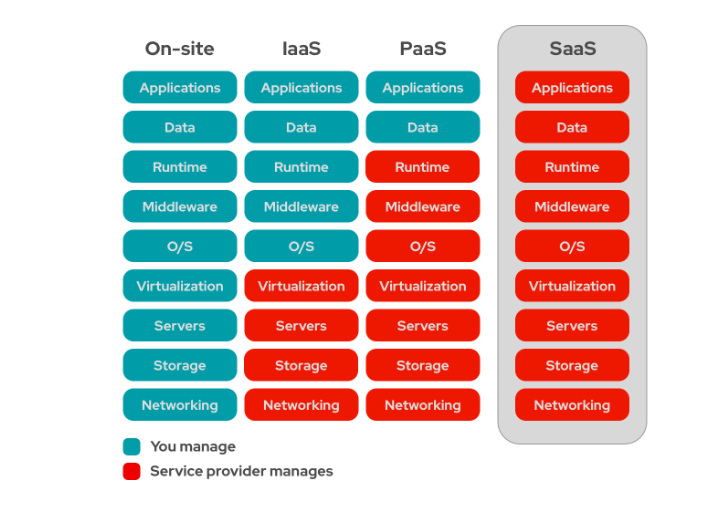

## ERP Nedir.?
* Enterprise Resource Planning(Kurumsal Kaynak Planlama)
* Kurumların muhasebe, satın alma, proje yönetimi, risk yönetimi ve mevzuat uyumunun yanı sıra tedarik zinciri 
operasyonları gibi günlük iş faaliyetlerini yönetmek için kullandığı bir yazılım türünü ifade eder.
* Eksiksiz bir ERP ürün seti, bir kurumun finansal sonuçlarını planlamaya, bütçelemeye, tahmin etmeye ve raporlamaya 
yardımcı olan <u><i>Enterprise Performance Management</i></u> yazılımını da içerir.
* ERP sistemleri, çok sayıda iş sürecini bir araya getirir ve bu iş süreçleri arasında veri akışı sağlar. 
* ERP sistemleri, birden fazla kaynaktan organizasyonun ortak işlemsel verilerini toplayarak veri yinelemesini 
ortadan kaldırır ve veri bütünlüğü sağlar.

<hr>

### ERP Sistemlerinin Temel Prensipleri
* ERP sistemleri, genellikle ortak bir veritabanı üzerinde tek ve tanımlı veri yapısı (şema) kullanacak şekilde tasarlanır. 
Bu da kurum genelinde kullanılan bilgilerin normalleştirilmesine, genel tanımlara ve kullanıcı deneyimlerine dayalı hâle 
getirilmesine yardımcı olur. Bu temel yapılar daha sonra işletme departmanlarındaki (örneğin finans, insan kaynakları, 
mühendislik, pazarlama ve operasyon) iş akışlarının getirdiği iş süreçleriyle birbirine bağlanır, 
sistemler ve bunları kullanan insanlar arasında bağlantı sağlar. 
<i>Kısaca söylemek gerekirse ERP, modern bir kurumda çalışan, süreç ve teknolojileri entegre etmeye yarar.</i>
* ERP sistemlerinin temel amacı, işletmenin farklı departmanları arasındaki işlemleri ve verileri entegre etmektir. 
Bu entegrasyon, veri tutarlılığını sağlar ve iş süreçlerinin verimli bir şekilde yürütülmesine olanak tanır.
* ERP sistemleri, tekrar eden görevleri otomatikleştirerek iş süreçlerinin daha hızlı ve hatasız yürütülmesini sağlar. 
Bu, çalışanların zamanını daha stratejik görevlere ayırmasına ve verimliliğin artmasına yardımcı olur.
* ERP sistemleri, tüm iş süreçlerinde kullanılan verileri merkezi bir veri tabanında toplar. 
Bu, veriye erişimi kolaylaştırır ve karar verme süreçlerinde güncel ve doğru bilgilere dayanılmasını sağlar.
* ERP sistemleri genellikle modüler bir yapıya sahiptir. Bu, işletmelerin ihtiyaç duydukları modülleri seçmelerine ve 
zamanla yeni modüller ekleyerek sistemi genişletmelerine olanak tanır.
* ERP sistemleri, işletmelerin büyüme ve değişim ihtiyaçlarına uyum sağlayabilecek şekilde tasarlanmıştır. 
Sistemler, işletmelerin büyüklüğüne ve sektörlerine göre özelleştirilebilir ve ölçeklenebilir olmalıdır.
* ERP sistemlerinin kullanıcı arayüzleri, kullanıcıların sistemden kolayca faydalanabilmesi için sezgisel ve kullanıcı 
dostu olmalıdır. Bu, eğitim süreçlerini kolaylaştırır ve kullanıcı kabulünü artırır.
* ERP sistemleri, işletmelerin kritik verilerini içerdiği için güçlü güvenlik önlemleri ile donatılmalıdır. 
Veri gizliliği, bütünlüğü ve erişilebilirliği, yetkilendirme ve kimlik doğrulama mekanizmalarıyla korunmalıdır.
* ERP sistemleri, yerel ve uluslararası düzenlemelere, endüstri standartlarına ve en iyi uygulama prensiplerine uygun 
olmalıdır. Bu, işletmelerin yasal gereklilikleri karşılamasına ve sektör standartlarında kalmalarına yardımcı olur.

<hr>

## SaaS ERP
Bunun için öncelikle SaaS'ı tam manasıyla anlamak gerekir.


Öncelik olarak görseldeki katmanları tanıyarak başlayalım. <br>
- <b>Applications:</b> Bu katman, son kullanıcı tarafından doğrudan kullanılan yazılımları içerir. Örneğin e-posta, 
müşteri ilişkileri yönetimi (CRM), ve iş akışı yönetimi gibi iş uygulamaları. Bu uygulamalar genellikle iş süreçlerini 
otomatikleştirmeye, veri analizine, kullanıcı etkileşimine veya diğer özgül işlevlere yardımcı olmak için tasarlanmıştır.
- <b>Data:</b> İşletmelerin veya uygulamaların oluşturduğu, işlediği ve depoladığı bilgiler. Veritabanları, 
veri ambarları, ve büyük veri işleme platformları bu katmana örnek olarak verilebilir.
- <b>Runtime:</b> Uygulamaların çalıştırılabilmesi için gerekli olan yazılım ortamını ifade eder. 
Java Runtime Environment (JRE) veya .NET Framework gibi uygulama çerçeveleri bu katmanda yer alır.
- <b>Middleware</b>: Farklı yazılım uygulamaları arasında aracılık eden ve onların birbiriyle iletişimini kolaylaştıran 
yazılımlardır. Mesajlaşma servisleri, web sunucuları ve uygulama sunucuları bu katmanda yer alabilir.
- <b>Operating System(OS)</b>: Bilgisayarın veya sunucunun temel yazılımını oluşturur.
- <b>Virtualization</b>: Tek bir fiziksel sunucunun birden çok sanal makine olarak bölünmesini sağlayan teknoloji.
Bu sayede kaynaklar daha verimli kullanılabilir ve farklı işletim sistemleri veya uygulamalar aynı fiziksel donanım 
üzerinde çalıştırılabilir.
- <b>Servers</b>: Ağ üzerinden hizmet sağlayan ve genellikle uygulamaların çalıştırıldığı fiziksel veya sanal makinelerdir.
Veri merkezlerinde barındırılabilir veya bulut hizmetleri aracılığıyla kiralanan sanal sunucular şeklinde olabilir.
- <b>Storage</b>: Veri saklama için kullanılan sistemleri içerir.
Fiziksel sabit diskler, SAN (Storage Area Network) ve NAS (Network Attached Storage) bu katmana örnektir.
- <b>Networking</b>: Bilgisayarlar, sunucular ve diğer cihazların birbirleriyle ve internetle iletişim kurmalarını
sağlayan yapıdır. Switchler, routerlar, gatewayler bu katmana dahildir.


### SaaS nedir
Software-as-a-service (SaaS), bir bulut uygulamasını - ve tüm altındaki BT altyapısını ve platformlarını 
internet tarayıcısı aracılığıyla son kullanıcılara sunan bir bulut bilişim biçimidir. 

SaaS uygulamaları, yazılım lisanslarını sağlamada büyük ölçüde abonelik modellerine bağlıdır. Sürekli bir lisansın aksine, 
bu yazılım dağıtım modeli, her hesabı genellikle yıllık veya aylık bazda belirli bir süre boyunca SaaS erişimi sağlayan 
bir aboneliğe bağlar. Abonelik ücreti genellikle bir service level agreement (SLA hizmet seviyesi anlaşması) tarafından 
yönetilen ürün dokümantasyonuna ve devam eden desteğe erişim sağlar, ancak bazı SaaS sağlayıcıları kaynak kod seviyesinde 
özel kod değişiklikleri yapmak için ek destek ücretleri talep eder.

```
Neden SaaS ERP tercih edilmeli.?

Birçok BT departmanı için, ERP sistemleri genellikle önemli donanım veya altyapı yatırımları gerektirebilecek büyük, 
maliyetli ve zaman alıcı devreye alma işlemleri anlamına geliyordu. SaaS devreye alımlarının ortaya çıkması, 
işletmelerin ERP hakkındaki düşüncelerinin değişmesine neden olan etmenler arasında ön sırada yer almaktadır.

ERP'yi buluta taşımak, işletmelerin teknoloji gereksinimlerini basitleştirmesine ve yatırımlarından daha hızlı sonuç 
almalarına olanak sağlar.

-> Daha düşük ön maliyetler
 * Ek donanım ve orta katman ihtiyacını kaldırmak
 * Kurulum ve uygulama maliyetlerini azaltma

-> Öngörülebilir, sürekli maliyetler
 * Yazılım ve donanımlara yönelik öngörülemeyen yönetim, düzeltme eki uygulama ve güncelleme maliyetlerini ortadan kaldırma
 * Sermaye harcamalarını kullandıkça öde türünde operasyonel harcamalara dönüştürmek
 * Teknik maliyet yerine fonksiyonel maliyetlere odaklanmak
 
-> İsteğe bağlı ölçeklenebilirlik
 * Artan verileri yönetmek veya işlem taleplerini karşılamak için anında ölçeklendirme
 * Servis seviyelerini korurken aksaklıkları azaltma
 
-> Daha hızlı değere dönüştürme süresi
 * Yeni fonksiyonelliği hemen uygulamak
 * Geleneksel, şirket içi uygulamalardan daha az gerekli BT desteği ile maliyetleri azaltmak
 
-> Daha fazla inovasyon
 * Standartlaştırılmış fonksiyonellik ile destek, analitik ve iş birliği araçlarına kolayca erişmek
 
-> Küreselleşme stratejilerine yönelik destek
 * Standartlaştırılmış süreçlerle işletme genelinde kârlılık ve maliyete ilişkin daha fazla şeffaflık ve içgörü edinmek
 * Farklı ülkelerdeki finans kaynakları arasında gelişmiş iş birliği

```